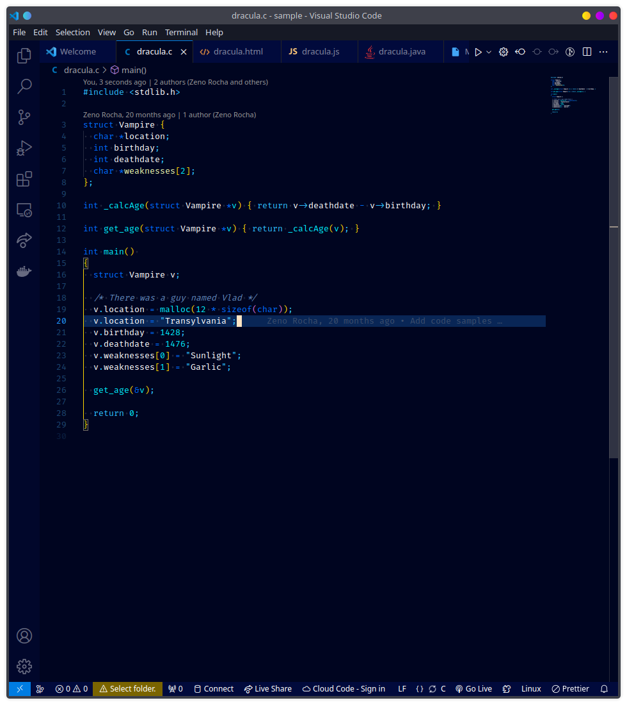
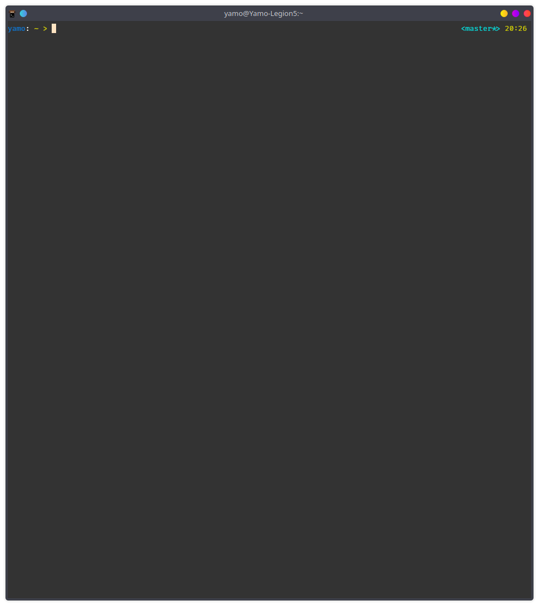

# ZenBlue README

Inspired by the abyss theme and configured for all those blue lovers out there.

---

## Preview

### Preview of VS Code

  

### Preview of ZSH

---

## Installation

### VS Code theme:

1. Go to [ZenBlue in VS Marketplace](https://marketplace.visualstudio.com/items?itemName=Yamo.ZenBlue&ssr=false#overview)
2. click on the "install" button

alternatively you can search for ZenBlue in the extensions panel on the left side of VScode, then click on "install"

### ZSH:

1. Download the package using `git clone https://github.com/Yamo406/ZenBlue-theme/zshTheme.git`
2. Move the `ZenBlue.zsh-theme` to your zsh themes folder
    e.g. mine's located at `.oh-my-zsh/themes/`
3. Open your `.zshrc` file and add this line to it `ZSH_THEME="ZenBlue"`
4. `source .zshrc` 

You will find the color palette in a markdown with all the hexcode used to get more details about it you can check the theme files or just check the github repo for this theme <https://github.com/Yamo406/ZenBlue-theme.git>

Configure it for your liking <3
