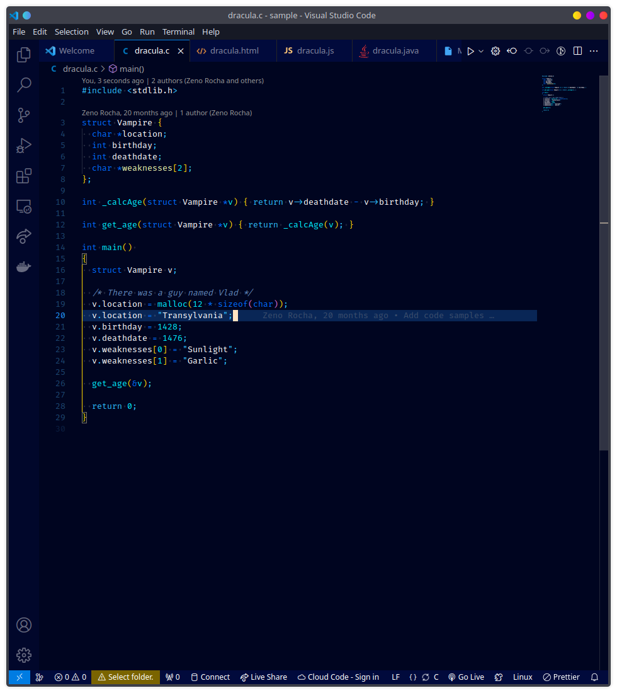
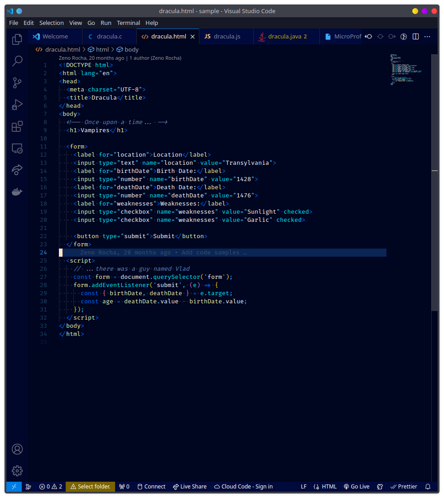
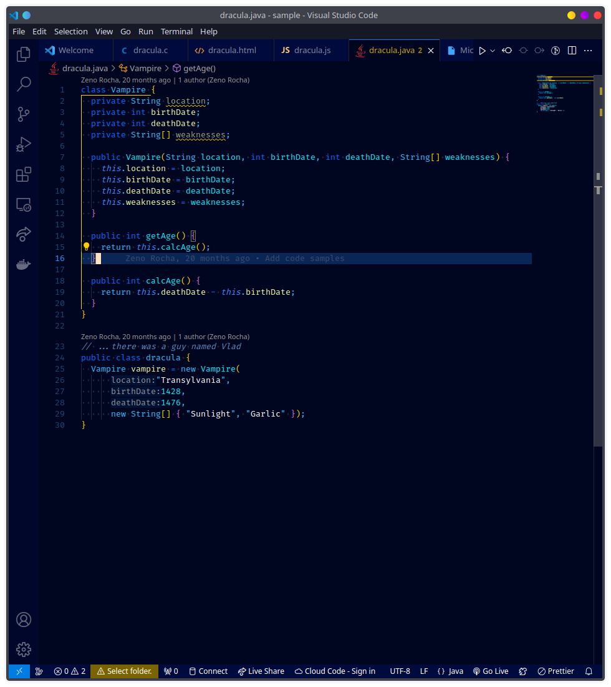

# ZenBlue README

Inspired by the abyss theme and configured for all those blue lovers out there.

---

## Preview

### Preview of VS Code

### Install

1. Go to [ZenBlue in VS Marketplace](https://marketplace.visualstudio.com/items?itemName=Yamo.ZenBlue&ssr=false#overview)
2. click on the "install" button

alternatively you can search for ZenBlue in the extensions panel on the left side of VScode, then click on "install"

You will find the color palette in a markdown with all the hexcode used to get more details about it you can check the theme files or just check the github repo for this theme <https://github.com/Yamo406/ZenBlue-theme.git>

Configure it for your liking <3
